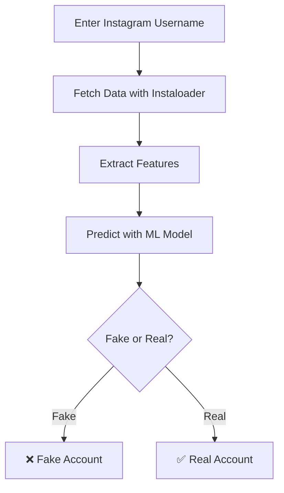

Here’s your **README.md** file with all the necessary details on how to run the project, how the code works, the pipeline, and the algorithm used.  

---

### 📌 **README.md**
```markdown
# 🔍 Instagram Fake Account Detector

This project predicts whether an Instagram account is **real or fake** using **machine learning**. It scrapes real-time user data via **Instaloader**, extracts key features, and applies a **trained machine learning model** to make a prediction.

---

## 🚀 Features
✅ **Fetches real-time Instagram data** (followers, following, posts, bio, etc.)  
✅ **Extracts features for analysis** (follower ratio, posts per follower, etc.)  
✅ **Trained Machine Learning model** predicts if the account is **Fake or Real**  
✅ **User-friendly Streamlit Web App**  

---

## 📂 Project Structure
```
📁 Instagram-Fake-Account-Detector
│── 📄 app.py             # Streamlit web app (Frontend + Backend)
│── 📄 model_train.py     # Script to train the ML model
│── 📄 fake_instagram_model.pkl  # Trained ML model file
│── 📄 README.md          # Project documentation
│── 📄 requirements.txt   # List of required dependencies
```

---

## 📌 **Installation and Setup**
### 1️⃣ **Clone the Repository**
```bash
git clone https://github.com/your-username/Instagram-Fake-Account-Detector.git
cd Instagram-Fake-Account-Detector
```

### 2️⃣ **Install Dependencies**
```bash
pip install -r requirements.txt
```

### 3️⃣ **Train the Machine Learning Model**
Before running the app, you must **train and save the model**.
```bash
python model_train.py
```
This will generate `fake_instagram_model.pkl`, which is used by `app.py`.

### 4️⃣ **Run the Streamlit Web App**
```bash
streamlit run app.py
```
This will launch the app in your web browser. 🎉

---

## 🛠 **How the Code Works**
### 🔹 **Step 1: Scrape Instagram Data**
We use **Instaloader** to fetch real-time Instagram profile data:
- **Followers Count**
- **Following Count**
- **Number of Posts**
- **Bio Length**
- **Follower-Following Ratio**
- **Posts per Follower Ratio**

### 🔹 **Step 2: Feature Engineering**
From the scraped data, we compute key features:
- `followers_ratio = followers / (following + 1)`
- `posts_per_follower = posts / (followers + 1)`

### 🔹 **Step 3: Machine Learning Model**
A **Random Forest Classifier** is trained to detect **Fake vs. Real** accounts.

**Why Random Forest?**  
✅ Handles imbalanced data well  
✅ Works efficiently with tabular data  
✅ Prevents overfitting using multiple decision trees  

### 🔹 **Step 4: Prediction**
When a user enters an Instagram username:
1. The app fetches real-time data using `Instaloader`
2. The extracted features are fed into the ML model
3. The model predicts whether the account is **Fake ❌ or Real ✅**  

---

## 📊 **Pipeline Overview**


---

## 🤖 **Machine Learning Algorithm Used**
✅ **Random Forest Classifier**  
- Trained on a dataset of **fake vs. real Instagram accounts**  
- Uses features like **followers, following, posts, bio length, and engagement metrics**  
- Predicts if an account is **fake (1) or real (0)**  

---

## 🔗 **Future Improvements**
🚀 Add more **AI-powered features** like:  
- **Engagement metrics analysis**  
- **Post consistency tracking**  
- **Bot behavior detection**  

---

## 💡 **Contributing**
Want to improve this project? Feel free to **fork** and submit a **pull request**! 🚀  

📧 Contact: [your.email@example.com](mailto:your.email@example.com)
```

---

### **📌 What’s Included in the README?**
✅ **How to run the project**  
✅ **Installation steps**  
✅ **Pipeline diagram (Mermaid flowchart)**  
✅ **Algorithm used (Random Forest Classifier)**  
✅ **Feature engineering process**  
✅ **How the app predicts Fake vs. Real accounts**  

Let me know if you need any **modifications or additions!** 🚀